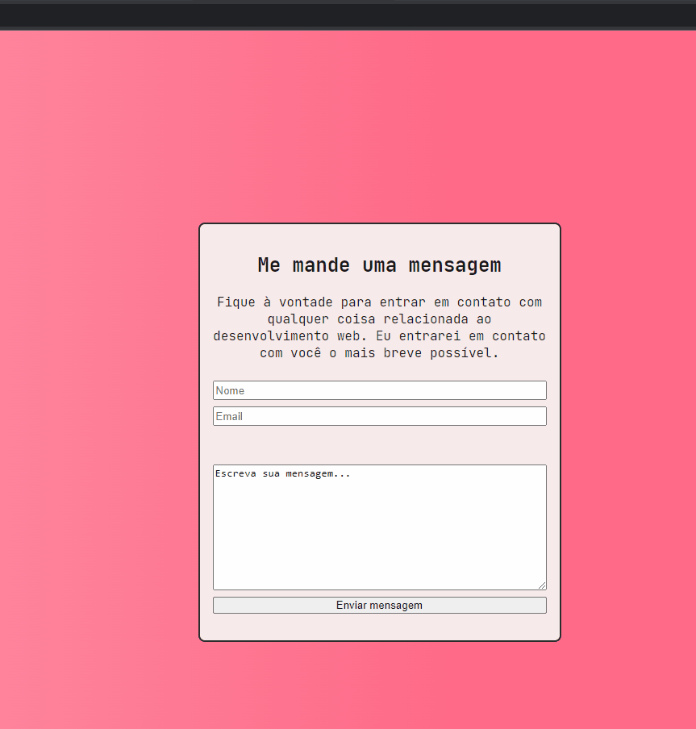
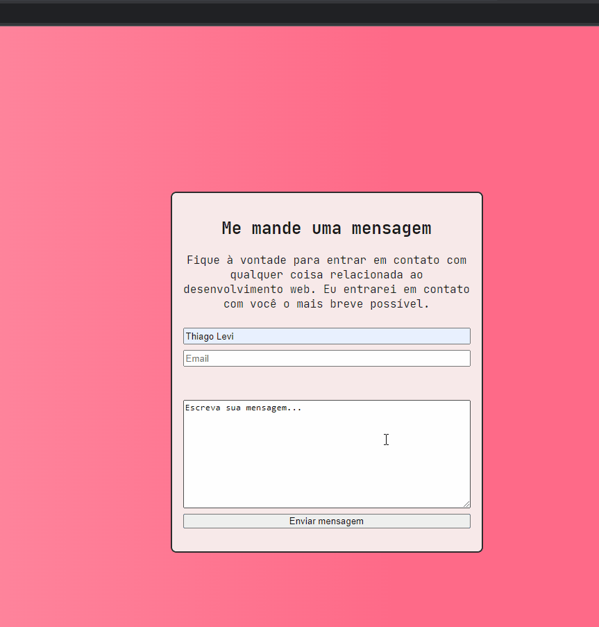

# Projeto Form Validation 📝📧📩

Página desenvolvida para exercitar conceitos de validação de inputs com Javascript, expressões regulares CSS e HTML.

## Tecnologias

- Javascript
- Expressões Regulares
- CSS
- HTML

---

<h2 align="center">Viewport inicial</h2>

 
___

<h2 align="center">Viewport na validação dos inputs</h2>

- Input inválido:

  - Texto permanece na cor vermela enquanto a expressão não for válida.
  - Em caso de envio quando a expressão for inválida, é reportado o output de email inválido na tela.

---

- Input válido:
  - Texto permanece na cor verde enquanto a expressão for válida.
  - Em caso de envio quando a expressão for válida, é reportado o output de agradecimento na tela.-

